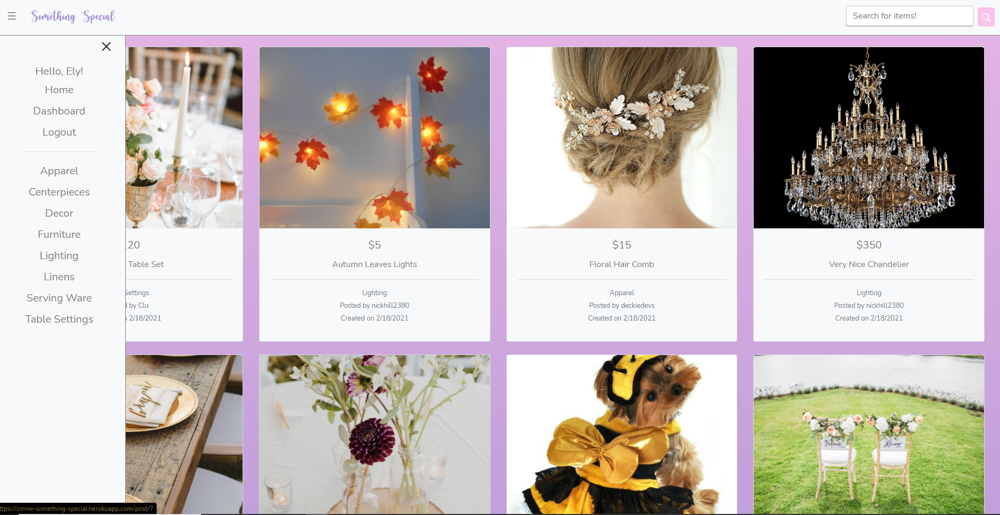

  # Something Special
  
  
  ### UCF Coding Boot-Camp Project 2
  

  ## Description
  An application provides a service for users to be able to easily access a community forum for event-related decorations.  *In Progress*

  ## Table of Contents
  
* [Description](#Description)
* [Installation](#Installation)
* [Usage](#Usage)
* [Features](#Features)
* [Production](#Production)
* [Questions](#Questions)
* [Contribution](#Contribution)

 

  ## Installation
  * Clone down the application from GitHub. *In Progress*

  ## Usage
  * Load site from domain. *In Progress*

  
  ## Features
  * Smooth interface and very responsive. *In Progress*
  

  
  ## Production
  [Something-Special](https://cmnw-something-special.herokuapp.com/)
  
  
  
  

  
  

  

  ## Questions
  Please feel free to reach out to us for additional questions at:
   
  Email: Clu.Codes@gmail.com (Clu-Codes@gmail.com)
  Email: Deckiedevs@gmail.com (DeckieDevs)
  Email: @gmail.com (Nickhill2380)
  Email: Elysiayn@gmail.com (Elysiayn)

  
  ### Contributions
  Visit our GitHub!
  * [Clu-Codes](https://github.com/Clu-Codes)
  * [DeckieDevs](https://github.com/DeckieDevs)
  * [Nickhill2380](https://github.com/Nickhill2380)
  * [Elysiayn](https://github.com/Elysiayn)